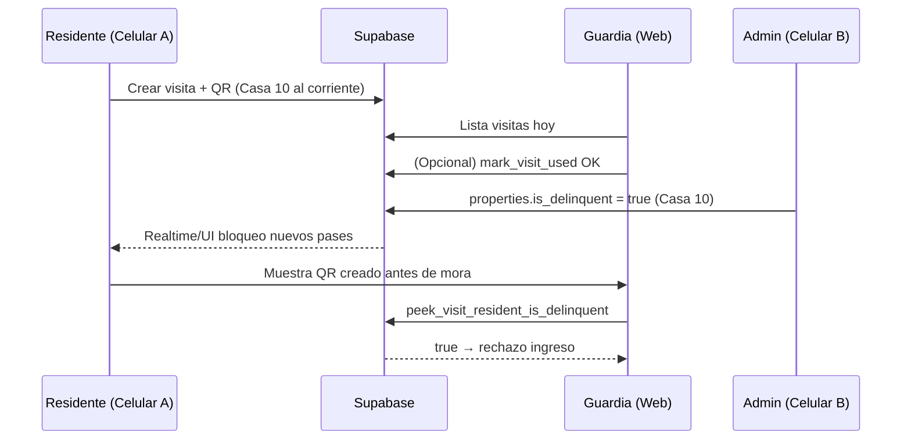

# NCoto — Preparación de usuarios demo y guión paso a paso

Guía operativa para armar **coto, casas y cuentas** en Supabase y ejecutar el demo del **WOW de mora** (QR creado antes del bloqueo sigue rechazado en caseta).

**Documentos relacionados:** `NCOTO_DEMO_FLOW.md`, `NCOTO_MVP_SCOPE.md`, `NCOTO_TECH_STABILIZATION.md`.

---

## 0. Qué debes tener en mente (reglas del sistema)

| Regla | Por qué importa en el demo |
|-------|---------------------------|
| Cada usuario Auth necesita fila en **`profiles`** con `role` y `coto_id` | Sin perfil → pantalla “Perfil no encontrado” |
| El **residente** debe tener **`property_id`** vinculado a una fila en **`properties`** | Sin unidad → mora no aplica; Pagos muestra error |
| **`approval_status = approved`** para residente demo | Si está `pending` → pantalla de espera, no llega a QR |
| **Guardia** y **residente** deben compartir el **mismo `coto_id`** | Si no, caseta no ve la visita / RPC falla |
| La mora es por **casa** (`properties.is_delinquent`), no por QR | El QR **no cambia** al marcar mora; el **sistema** rechaza en caseta |
| Caseta comprueba mora **en el momento del escaneo** (`peek_visit_resident_is_delinquent`) | QR generado **antes** del bloqueo **sigue siendo rechazado** si la casa ya está en mora |
| Crear **nuevas** visitas con mora activa está bloqueado (RLS + UI) | El residente **sí puede seguir viendo** pases viejos en pantalla |
| Para la lista “Visitas previstas hoy” (web) | Usa visita tipo **eventual/servicio/paquetería** con **`validDay` = hoy** (fecha local) |
| Rol **`admin` global** con varios cotos | Antes del demo, selecciona el coto activo (`SuperCotoSelector`) o fija `active_coto_id` en BD |
| Guardia usa **`coto_id` físico** del perfil, no el coto activo del superadmin | El usuario guardia debe tener `coto_id` = tu coto demo |

---

## 1. Inventario mínimo para este demo

### Dispositivos / pantallas

| Dispositivo | Rol | App / URL |
|-------------|-----|-----------|
| **Celular A** | Residente (el que será moroso) | App Expo — login residente |
| **Celular B** (opcional) | Admin | App Expo — login admin |
| **Laptop** | Guardia | Navegador → `https://<tu-host>/guardia/scan` |
| **Celular B o laptop** | Admin (si no hay segundo móvil) | App o `https://<tu-host>/admin/dashboard` |

### Cuentas (3 obligatorias)

| Cuenta sugerida | Rol en `profiles` | Casa |
|-----------------|-------------------|------|
| `demo.residente@tudominio.com` | `resident` | **Casa 10** (la que pondrás en mora) |
| `demo.guardia@tudominio.com` | `guard` | — (solo coto) |
| `demo.admin@tudominio.com` | `coto_admin` o `admin` | — |

Opcional: segunda casa **Casa 20** con otro residente al corriente (solo si quieres contrastar en Directorio).

### Datos en Supabase (1 coto + 1–2 casas)

| Entidad | Ejemplo |
|---------|---------|
| Coto | `Fraccionamiento Demo NCoto` |
| Propiedad | `Casa 10`, `is_delinquent = false` al inicio |
| Visita | 1 pase **eventual**, visitante “Juan Pérez”, **día de hoy** |

---

## 2. Crear coto y casas en Supabase

### Opción A — SQL Editor (recomendado, repetible)

En **Supabase → SQL Editor**, ejecuta (ajusta nombre y UUID si ya tienes coto):

```sql
-- 1) Coto demo (usa UUID fijo o genera uno y guárdalo)
INSERT INTO public.cotos (id, name, slug)
VALUES (
  'aaaaaaaa-bbbb-cccc-dddd-eeeeeeeeeeee'::uuid,
  'Fraccionamiento Demo NCoto',
  'demo-ncoto'
)
ON CONFLICT (id) DO UPDATE SET name = EXCLUDED.name;

-- 2) Casas (unidades)
INSERT INTO public.properties (coto_id, house_number, is_delinquent)
VALUES
  ('aaaaaaaa-bbbb-cccc-dddd-eeeeeeeeeeee'::uuid, '10', false),
  ('aaaaaaaa-bbbb-cccc-dddd-eeeeeeeeeeee'::uuid, '20', false)
ON CONFLICT DO NOTHING;

-- Verifica IDs de propiedades (copia el id de Casa 10 para el residente)
SELECT id, house_number, is_delinquent
FROM public.properties
WHERE coto_id = 'aaaaaaaa-bbbb-cccc-dddd-eeeeeeeeeeee'::uuid
ORDER BY house_number;
```

**Anota:**

- `COTO_ID` = `aaaaaaaa-bbbb-cccc-dddd-eeeeeeeeeeee`
- `PROPERTY_ID_CASA_10` = uuid de la fila `house_number = '10'`

### Opción B — Desde la app (después de tener admin)

- Admin → **Residentes** → al aprobar un vecino, la app puede **crear** la propiedad si no existe (`approveResident` en `directoryRepo.ts`).
- Admin → **Panel** lista casas si ya existen filas en `properties`.

Para el demo, **Opción A** evita sorpresas el día de la presentación.

---

## 3. Crear usuarios en Supabase Auth

### Paso 3.1 — Authentication → Users → Add user

Repite para cada cuenta:

| Campo | Valor |
|-------|--------|
| Email | `demo.residente@...`, etc. |
| Password | Una contraseña segura que recuerdes (ej. solo para demo) |
| **Auto Confirm User** | ✅ **Activado** (evita bloqueo por email no confirmado) |

Copia el **User UID** de cada uno (columna `id` en Auth = `profiles.id`).

### Paso 3.2 — Vincular perfiles (`profiles`)

Tras crear en Auth, el trigger suele crear una fila en `profiles`. Actualízala en **SQL Editor**:

```sql
-- Reemplaza los UUIDs de usuario y de coto/propiedad

-- RESIDENTE (Casa 10, aprobado, con unidad)
UPDATE public.profiles
SET
  coto_id = 'aaaaaaaa-bbbb-cccc-dddd-eeeeeeeeeeee'::uuid,
  role = 'resident'::public.user_role,
  property_id = '<PROPERTY_ID_CASA_10>'::uuid,
  house_number = '10',
  display_name = 'Vecino Demo Casa 10',
  full_name = 'Vecino Demo Casa 10',
  approval_status = 'approved'::public.profile_approval_status,
  email = 'demo.residente@tudominio.com'
WHERE id = '<UID_RESIDENTE>'::uuid;

-- GUARDIA (mismo coto, sin property_id)
UPDATE public.profiles
SET
  coto_id = 'aaaaaaaa-bbbb-cccc-dddd-eeeeeeeeeeee'::uuid,
  role = 'guard'::public.user_role,
  property_id = NULL,
  display_name = 'Guardia Demo',
  approval_status = 'approved'::public.profile_approval_status,
  email = 'demo.guardia@tudominio.com'
WHERE id = '<UID_GUARDIA>'::uuid;

-- ADMIN LOCAL (coto_admin) o SUPER (admin)
UPDATE public.profiles
SET
  coto_id = 'aaaaaaaa-bbbb-cccc-dddd-eeeeeeeeeeee'::uuid,
  role = 'coto_admin'::public.user_role,  -- o 'admin'
  property_id = NULL,
  display_name = 'Admin Demo',
  approval_status = 'approved'::public.profile_approval_status,
  email = 'demo.admin@tudominio.com'
WHERE id = '<UID_ADMIN>'::uuid;

-- Si usas rol admin global y tienes varios cotos:
-- UPDATE public.profiles
-- SET active_coto_id = 'aaaaaaaa-bbbb-cccc-dddd-eeeeeeeeeeee'::uuid
-- WHERE id = '<UID_ADMIN>'::uuid;
```

### Paso 3.3 — Verificación rápida (SQL)

```sql
SELECT id, email, role, coto_id, property_id, house_number, approval_status
FROM public.profiles
WHERE email LIKE 'demo.%@tudominio.com'
ORDER BY role;
```

Debe verse:

- Residente: `role = resident`, `property_id` **no null**, `approval_status = approved`
- Guardia: `role = guard`, mismo `coto_id`
- Admin: `role = coto_admin` o `admin`, mismo `coto_id`

---

## 4. Alternativa: crear usuarios desde la app

Si prefieres no usar SQL para usuarios:

1. Login como **admin** ya existente (o crea el primero en Dashboard).
2. App → **Usuarios** → crear con Edge Function `admin-create-user` (ya desplegada).
3. Asignar rol `guard` / `resident` y **mismo `coto_id`**.
4. Para **residente**, la Edge Function **no** asigna `property_id` automáticamente:
   - Ve a **Residentes** y **aprueba** con casa `10`, **o**
   - Ejecuta el `UPDATE` de `property_id` en SQL del paso 3.2.

---

## 5. Checklist pre-demo (5 minutos antes)

- [ ] `mobile/.env` y `web/.env.local` → mismo proyecto Supabase.
- [ ] Web: `npm run dev` → abre `/guardia/scan`.
- [ ] Móvil: Expo con app cargada.
- [ ] Login **residente** → llega a Inicio (no “Esperando aprobación”).
- [ ] Login **guardia** en web → no pide rol incorrecto.
- [ ] Login **admin** → Panel muestra **Casa 10** y **Casa 20** (o las que creaste).
- [ ] `properties.is_delinquent = false` para Casa 10 al empezar.
- [ ] Reloj del sistema en **fecha de hoy** (afecta `validDay`).

---

## 6. Guión del demo — orden exacto por perfil

Duración orientativa: **12–15 min** (incluye WOW mora).

---

### FASE A — Residente: crea el pase (Celular A)

**Login:** `demo.residente@...`

| Paso | Pantalla | Acción | Qué decir |
|------|----------|--------|-----------|
| A1 | Inicio `(resident)/index` | Confirmar que **no** hay banner de mora | “El vecino opera normal.” |
| A2 | **Visitas** | Tipo **Eventual** (o Servicio/Paquetería) | “Elige el tipo de acceso.” |
| A3 | Formulario | Visitante: `Juan Pérez Demo`; fecha **hoy**; guardar | “El pase queda vigente solo hoy.” |
| A4 | Detalle `(resident)/visit/[id]` | Mostrar **QR** grande | “Comparte el QR; caseta no necesita el celular del vecino.” |
| A5 | (Opcional) Inicio | Ver pase en “Pases próximos” | “Todo centralizado en la app.” |

**Importante:** **No cierres sesión** en Celular A. Deja el **QR visible** (detalle del pase) para la Fase D.

**Si falla:** revisa `property_id` y que no esté en mora antes de empezar.

---

### FASE B — Guardia: lista del día + primer ingreso (Laptop)

**URL:** `/guardia/scan`  
**Login:** `demo.guardia@...`

| Paso | Pantalla | Acción | Qué decir |
|------|----------|--------|-----------|
| B1 | Login web | Email + contraseña guardia | “Caseta trabaja en navegador, con lector USB o simulación.” |
| B2 | **Visitas previstas hoy** | Buscar `Juan Pérez Demo` | “El guardia ve lo esperado sin llamar al residente.” |
| B3 | Botón **Simular escaneo** en esa fila | Abre flujo del pase | Equivalente a escanear el QR |
| B4 | Confirmar ingreso (placas opcional) | **Confirmar acceso** | “Primera entrada registrada con trazabilidad.” |
| B5 | (Opcional) Segundo pase | Residente crea **otro** pase en A (mismo día) **sin validar aún** | Para demostrar rechazo después con QR “viejo” |

**Para el WOW de mora**, lo más claro es:

- **Un pase creado en A4 que NO hayas marcado como ingresado en B4**, **o**
- Crear un **segundo pase** después de B4 y **no** validarlo hasta después de la mora.

**Recomendación práctica:**

1. A4 crea pase #1 → muestra QR.  
2. B2–B4: puedes validar **otro** visitante de prueba **o** saltar validación del #1.  
3. A4: crea pase #2 (o deja #1 sin ingresar) — ese QR será el que escaneas **después** de la mora.

---

### FASE C — Admin: residentes por casa + activar mora (Celular B o web)

**Login:** `demo.admin@...`  
Si es `admin` global: **selecciona el coto demo** en el selector superior.

| Paso | Pantalla | Acción | Qué decir |
|------|----------|--------|-----------|
| C1 | **Panel** `(admin)/index` o web `/admin/dashboard` | Mostrar lista de casas (semáforo verde/rojo) | “Administración ve el fraccionamiento por unidad.” |
| C2 | (Opcional) **Residentes** `directory` | Tab **Activos** — ver vecino Casa 10 | “Vecinos aprobados vinculados a su casa.” |
| C3 | **Panel** | Activar toggle **Marcar en mora** en **Casa 10** | “Un clic aplica la política en todo el sistema.” |

**No desactives mora hasta terminar la Fase D.**

---

### FASE D — WOW: residente moroso + QR antiguo rechazado (2 dispositivos)

#### D1 — Celular A (residente), **sin cerrar sesión**

| Paso | Qué ocurre | Qué decir |
|------|------------|-----------|
| D1a | En **Inicio**: banner “Funcionalidad restringida por adeudo”; botón **Generar visita** deshabilitado | “Al instante el vecino pierde capacidad de generar **nuevos** pases.” |
| D1b | Ir a **Visitas** | La app te **redirige a Inicio** si detecta mora |
| D1c | Volver al **detalle del pase #1/#2** (QR que ya existía) | “El QR **sigue visible** en el teléfono — no es un papel que reemplazan.” |
| D1d | Intentar crear pase nuevo (si llegas al formulario) | Alert / bloqueo: no se pueden generar pases | “También bloqueado en servidor.” |

**Narrativa clave:** el QR no “se borra”; **la regla del fraccionamiento** cambió en tiempo real.

#### D2 — Laptop (guardia), mismo login

| Paso | Acción | Resultado esperado |
|------|--------|-------------------|
| D2a | **Simular escaneo** del pase creado **antes** de C3, **o** escanear QR en pantalla del Celular A | Carga datos del visitante |
| D2b | Sistema evalúa mora (`peek_visit_resident_is_delinquent`) | **Modal / bloqueo — ingreso denegado** |
| D2c | Intentar confirmar ingreso | Botón no debe completar ingreso si `delinquent` |

**Qué decir:** “Aunque el pase se generó antes del adeudo, **hoy** la casa está en mora y caseta **no deja pasar**.”

#### D3 — Cierre mora (opcional, 30 s)

| Paso | Acción |
|------|--------|
| D3 | Admin desactiva mora en Casa 10 |
| D3b | Residente: banner desaparece; puede generar visita otra vez |
| D3c | Guardia: mismo QR ahora **sí** permite confirmar (si sigue vigente hoy y `active`) |

---

## 7. Diagrama del flujo demo



---

## 8. Problemas frecuentes y solución

| Síntoma | Causa probable | Solución |
|---------|----------------|----------|
| “Perfil no encontrado” | Sin fila `profiles` | Paso 3.2 SQL |
| Residente en “Esperando aprobación” | `approval_status = pending` | `approved` + `property_id` |
| Caseta “Pase no encontrado” | Guardia en otro `coto_id` | Igualar `coto_id` |
| Lista “hoy” vacía | `validDay` no es hoy o tipo mal configurado | Crear eventual con fecha **hoy** |
| Mora no bloquea en caseta | Residente sin `property_id` | Vincular Casa 10 |
| Mora no actualiza residente | Realtime no publicado en `properties` | Dashboard → Database → Realtime; o reabrir app |
| Panel admin vacío | Superadmin sin coto activo | `active_coto_id` o selector en app |
| Edge Function 404 al crear usuario | Función no desplegada | Ya desplegada en tu proyecto; revisar slug |

---

## 9. Datos demo sugeridos (copiar/pegar)

| Campo | Valor |
|-------|--------|
| Coto nombre | Fraccionamiento Demo NCoto |
| Casa morosa | 10 |
| Casa sana (opcional) | 20 |
| Visitante pase | Juan Pérez Demo |
| Tipo visita | eventual |
| Emails | `demo.residente@`, `demo.guardia@`, `demo.admin@` |

---

## 10. Después del demo

- [ ] Quitar mora de Casa 10 si dejas el entorno para pruebas.
- [ ] Anotar contraseñas / rotar si fue demo público.
- [ ] Grabar video por fase (A, B, C, D) según `NCOTO_DEMO_FLOW.md` Plan B.

---

## 11. Resumen en una frase

**Prepara 3 usuarios en el mismo coto, residente vinculado a Casa 10, crea un pase con QR hoy, deja ese QR en pantalla, marca mora en admin, y muestra que caseta rechaza ese mismo QR aunque existía antes del bloqueo.**

---

*Actualizar si cambian IDs de coto seed o flujos de aprobación en migraciones futuras.*
