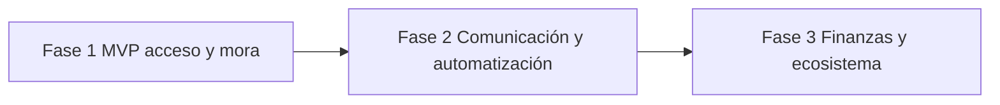

# NCoto — Roadmap de producto

**Alineado con:** `NCOTO_MVP_SCOPE.md` (alcance congelado MVP v1).  
**Principio:** lo que está en MVP v1 no se mueve a Fase 2 sin cerrar piloto; lo que ya existe en código pero está fuera del MVP v1 se etiqueta **“implementado parcial — activar en Fase 2”**.

---

## Resumen por fases

| Fase | Horizonte | Objetivo comercial |
|------|-----------|-------------------|
| **Fase 1 — MVP comercial** | Ahora | Demos, pilotos con administradoras, validar WOW mora + caseta |
| **Fase 2 — Operación avanzada** | Post-piloto | Comunicación, automatización, menos fricción operativa |
| **Fase 3 — Ecosistema completo** | Mediano plazo | ERP, finanzas, ecosistema, IA |

---

# Fase 1 — MVP comercial (núcleo estable)

Solo lo definido en `NCOTO_MVP_SCOPE.md`.

| Feature | Objetivo | Prioridad | Dependencia | Impacto comercial |
|---------|----------|-----------|-------------|-------------------|
| Pases QR (tipos de visita) | Eliminar listas manuales y llamadas para “avisar visita” | P0 | Supabase `visits`, Auth | Alto — uso diario residente |
| Caseta web (escaneo + lista hoy) | Operación estable en mostrador | P0 | `NEXT_PUBLIC_*`, usuario guard | Alto — WOW operativo |
| Caseta móvil (cámara) | Flexibilidad en campo | P1 | Permisos cámara, mismo backend | Medio |
| Mora automática (admin + bloqueos) | **WOW** — cobranza operativa sin discusión en caseta | P0 | `properties`, Realtime, RPC mora | **Muy alto** — diferenciador |
| Multi-tenant + RLS | Privacidad y venta a administradoras | P0 | Migraciones aplicadas | Alto — confianza B2B |
| Login por rol | Operación segregada | P0 | `profiles.role` | Alto |
| Directorio aprobación vecinos | Onboarding escalable en piloto | P1 | `approval_status`, properties seed | Medio — reduce carga admin manual |
| Alta usuarios (Edge Function) | Incorporar guardias sin Dashboard Supabase | P1 | `admin-create-user` desplegada | Medio |
| Superadmin selector de coto | Partners multi-fraccionamiento | P2 | `active_coto_id` | Medio en partnerships |
| Bitácora guardia | Trazabilidad básica post-ingreso | P2 | RLS guard | Bajo en venta, alto en compliance |

**Criterio de salida Fase 1:** checklist “MVP terminado” en `NCOTO_MVP_SCOPE.md` + al menos 1 piloto real con feedback documentado.

---

# Fase 2 — Operación avanzada

**Roadmap futuro — NO MVP v1.**  
Features que reducen fricción después de validar acceso + mora.

| Feature | Objetivo | Prioridad | Dependencia | Impacto comercial |
|---------|----------|-----------|-------------|-------------------|
| Push notifications (avisos, pago, ingreso) | Residente informado sin abrir app | P1 | Deploy `push-notifications`, `push_edge_config`, EAS `projectId` | Alto retención |
| Avisos / announcements en app | Comunicación formal del coto | P1 | Tab admin ya existe; pulir UX y no prometer push hasta F2 | Medio |
| WhatsApp proxy (guardia ↔ residente sin teléfono personal) | Privacidad + menos llamadas | P1 | Bot estable, `EXPO_PUBLIC_BOT_URL`, Meta o WebJS | **Muy alto** narrativa privacidad |
| Seguimiento paquetería EOD (cron bot) | Cerrar loop paquetería | P2 | Bot + `package_followup` | Medio |
| Emergencia (alerta caseta / log) | Seguridad percibida | P2 | Nueva RPC/tabla + notificación | Medio |
| Landing web + enlaces operativos | Profesionalizar demos | P2 | `web/app/page.tsx` | Bajo técnico, medio ventas |
| Lista “hoy” en app guardia (paridad web) | Una sola experiencia caseta | P3 | Reutilizar `listTodaysVisitsForGuard` | Bajo |
| Catálogo proveedores editable por admin | Menos “Otro” libre | P3 | Nueva tabla + UI | Bajo |

### Implementado parcial — activar en Fase 2 (no vender en v1)

| Módulo en repo | Qué falta para activar |
|----------------|------------------------|
| `push-notifications` + triggers | Desplegar función + config BD + probar en dispositivo |
| `bot/` + `(security)/chat.tsx` | URL bot, sesión WA o Meta, descomentar `guard-reply` |
| `(admin)/announcements.tsx` | Solo comunicación; quitar expectativa de push |
| `EmergencyConfirmControl` | Backend real |

---

# Fase 3 — Ecosistema completo

**Roadmap futuro — NO MVP v1.**

| Feature | Objetivo | Prioridad | Dependencia | Impacto comercial |
|---------|----------|-----------|-------------|-------------------|
| Comprobantes de pago + aprobación admin | Primer paso financiero sin ERP | P1 | Bucket `payment-proofs` confirmado, flujo estable | Alto administradoras |
| Tesorería / `coto_finances` / mesa directiva | Transparencia financiera | P2 | Fase 2 comunicación + datos limpios | Medio |
| Reconciliación / integraciones bancarias | Reducir trabajo manual cobranza | P3 | APIs bancarias, legal | Alto largo plazo |
| Partner Admin (multi-coto sin ser superadmin global) | Escalar administradoras | P2 | Modelo `user_coto_access`, RLS | Alto partnerships |
| Inquilino / delegado (roles finos) | Unidades con arrendamiento | P3 | Enum o `profile_kind`, RLS visitas | Medio |
| Módulo `deliveries` | Paquetería/entregas centralizada | P3 | UI + reglas | Medio |
| Integraciones Uber / Uber Eats | Acceso visitantes plataforma | P4 | APIs externas | Bajo inicial |
| Portal web administrativo completo | ERP ligero en navegador | P2 | Next.js dashboards | Alto |
| IA (soporte, anomalías, OCR comprobantes) | Eficiencia operativa | P4 | Datos históricos | Medio largo plazo |
| Reportes y analytics | Decisiones administración | P3 | Data warehouse / exports | Medio |

### Implementado parcial — Fase 3 (código existente)

| Módulo | Nota |
|--------|------|
| `(resident)/payments.tsx`, `(admin)/pending_payments.tsx` | No demo v1; piloto financiero Fase 3 |
| `(resident)/treasury.tsx`, `web/mesa/tesoreria` | Rol `board_member` — post-MVP |
| `deliveries` tabla | Sin UI |

---

## Matriz rápida: ¿Dónde va cada cosa?

| Si el stakeholder pide… | Respuesta |
|-------------------------|-----------|
| “¿Cobranza y comprobantes?” | Fase 3 (hay base técnica, no v1) |
| “¿WhatsApp?” | Fase 2 |
| “¿Push?” | Fase 2 |
| “¿Mora y QR en caseta?” | **Fase 1 — ya** |
| “¿ERP completo?” | Fase 3+ / fuera de visión actual |

---

## Dependencias entre fases

**Regla:** no iniciar Fase 3 comercial hasta tener al menos un piloto Fase 1 con métricas (ingresos validados, mora aplicada, N visitas/día).

---

*Actualizar al cerrar piloto Fase 1 o al promover una feature de Fase 2 a compromiso comercial.*
